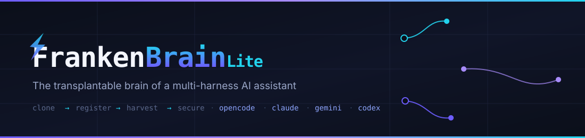

<p align="center">
  
</p>

<p align="center">
  <a href="LICENSE"></a>
  <a href="https://github.com/urielreyna06/FrankenBrain-Lite/actions"></a>
  
  
  
  
</p>

<p align="center">
  <em>One clone. Four harnesses. One working method — none of it rebuilt by hand.</em>
</p>

---

**FrankenBrain Lite** is the packaged brain of a long-lived AI assistant setup. It
gathers the workflow skills, specialist agents, commands, and rules your agent
learned — harvested and stitched together into a
[superpowers](https://github.com/obra/superpowers)-style plugin — so any fresh
machine can adopt the same capability by cloning and registering it once.

No re-installing. No drift. No teaching an assistant to work all over again.

```text
clone → register → harvest → secure
```

## What's inside

| Component | Count | Notes |
|-----------|:-----:|-------|
| [`skills/`](skills) | 21 | Procedural workflow skills — each `<name>/SKILL.md` |
| [`agents/`](agents) | 26 | Specialists for review, build repair, security, architecture |
| [`commands/`](commands) | 24 | Quick triggers: `plan`, `code-review`, `build-fix`, `save-session`… |
| [`rules/`](rules) | 9 | Always-loaded standards: `common/` + a full `java/` stack |
| [`scripts/`](scripts) | 4 | harvest · security-gate · validate · install-hooks |
| CI | 1 | `validate.yml` — security + validate + shellcheck on push |

**Skills, by family**

| Family | Skills |
|--------|--------|
| Build right | `systematic-debugging` · `ai-regression-testing` · `error-handling` |
| Stay honest | `verification-before-completion` · `delivery-gate` · `search-first` |
| Think first | `brainstorming` · `writing-plans` · `intent-driven-development` |
| Stay safe | `security-review` · `safety-guard` · `cloud-cli-operations` |
| Remember | `continuous-learning-v2` · `growth-log` · `knowledge-ops` · `unified-memory` |
| Run at scale | `continuous-agent-loop` · `eval-harness` · `cost-aware-llm-pipeline` · `context-budget` |
| Curate | `config-gc` · `rules-distill` · `skill-scout` |

**Agents, by role**

| Role | Agents |
|------|--------|
| Review | `code-reviewer` · `python-reviewer` · `go-reviewer` · `rust-reviewer` · `java-reviewer` · `kotlin-reviewer` · `cpp-reviewer` · `php-reviewer` · `database-reviewer` · `pr-test-analyzer` |
| Build repair | `build-error-resolver` · `go-build-resolver` · `rust-build-resolver` · `java-build-resolver` · `kotlin-build-resolver` · `cpp-build-resolver` |
| Strategy | `architect` · `agent-evaluator` · `harness-optimizer` · `loop-operator` |
| Quality & safety | `security-reviewer` · `silent-failure-hunter` · `refactor-cleaner` · `doc-updater` · `docs-lookup` · `e2e-runner` |

## Install

Pick your harness. Details for each are in the collapsible blocks.

| Harness | Install |
|---------|---------|
| **OpenCode** | Add `frankenbrain-lite@git+https://github.com/urielreyna06/FrankenBrain-Lite.git` to the `plugin` array in `~/.config/opencode/opencode.jsonc`; restart. |
| **Claude Code** | Add this repo as a plugin / marketplace source in `~/.claude/settings.json`. |
| **Gemini / Antigravity** | `gemini-extension.json` declares the plugin; `GEMINI.md` is the context file. |
| **Codex** | Clone the repo; point `AGENTS.md` and `rules/` from your Codex config. |

<details>
<summary>OpenCode</summary>

```jsonc
{
  "plugin": [
    "frankenbrain-lite@git+https://github.com/urielreyna06/FrankenBrain-Lite.git"
  ]
}
```

Already cloned? Reference the local path instead: `"./path/to/FrankenBrain-Lite"`.
Then restart OpenCode.
</details>

<details>
<summary>Claude Code</summary>

Add this repo as a plugin source in `~/.claude/settings.json` (plugins /
marketplace mechanism) pointing at `https://github.com/urielreyna06/FrankenBrain-Lite`.
It contributes `skills/`, `agents/`, `commands/`, `rules/`.
</details>

<details>
<summary>Gemini / Antigravity</summary>

`gemini-extension.json` declares the plugin; `GEMINI.md` is the context file it loads.
</details>

<details>
<summary>Codex</summary>

Clone the repo; reference `AGENTS.md` and `rules/` from your Codex config.
</details>

## Start with the workflow you need

| What you're doing | Start here |
|-------------------|------------|
| Building a feature | `brainstorming` → `writing-plans` → `test-driven-development` |
| Hunting a bug | `systematic-debugging` |
| Reviewing new code | `code-review`, then your language's reviewer |
| A failing build | the `build-error-resolver` for your stack |
| Shipping to prod | `security-review` · `verification-before-completion` |
| Ending / resuming a session | `save-session` / `resume-session` |
| Auditing your agent config | `harness-audit` · `config-gc` · `context-budget` |
| Refreshing what's installed | `make harvest` |

## Security

> [!WARNING]
> **This repo ships zero credentials — and it is public.** Never add or stage
> `.env`, `.aws/`, `.npmrc`, `.bashrc`, `.browserstack.env`, `*.key`, `*.pem`,
> or any private material. If a secret ever touches the repo, treat it as
> **exposed**: rotate it and purge it from history.

Secrets are per-machine, not per-repo. Credentials (BrowserStack, AWS SSO, a
corporate CA) belong **on the machine**, configured once, never stored here.
Enforcement is mechanical:

| Guard | What it does |
|-------|--------------|
| `.gitignore` | Lists forbidden paths up front |
| `scripts/security-gate.sh` | Scans the tree for credential patterns |
| `make install-hooks` | Pre-commit gate on every commit |
| CI | Re-runs gate + validate + shellcheck; fails on any hit |

**Do this once per machine:** configure cloud CLIs (AWS SSO, gcloud); create
`~/.browserstack.env` (`chmod 600`); import your corporate CA.

## Development

```bash
make harvest        # refresh harvested ECC artifacts (dry-run; --apply to write)
make validate       # parse config + check SKILL.md frontmatter
make security       # scan for credentials (exit non-zero on any hit)
make check          # validate + security
make install-hooks  # install the pre-commit gate
```

The pre-commit gate runs on every commit; CI enforces the same checks on push.

## License

[MIT](LICENSE) © 2026 uriel

---

*Assembled from a [superpowers](https://github.com/obra/superpowers)-style
packaging workflow. Security-conscious by construction. Batteries included —
live wires excluded.*
