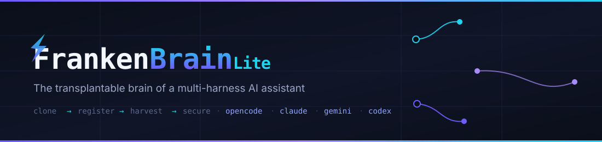

<p align="center">
  
</p>

<p align="center">
  <a href="LICENSE"></a>
  <a href="https://github.com/urielreyna06/FrankenBrain-Lite/actions"></a>
  
  
  
  
</p>

<p align="center">
  <em>One clone. Four harnesses. One working method — none of it rebuilt by hand.</em>
</p>

---

**FrankenBrain Lite** is the packaged brain of a long-lived AI assistant setup. It
gathers the workflow skills, specialist agents, commands, and rules your agent
learned — stitched together into a single-source
[superpowers](https://github.com/obra/superpowers)-style plugin — so any fresh
machine can adopt the same capability by cloning it and running `make install` once.

No re-installing. No drift. No teaching an assistant to work all over again.

```text
clone → make install → work → learn → make update
```

## What's inside

| Component | Count | Notes |
|-----------|:-----:|-------|
| [`skills/`](skills) | 32 | Procedural workflow skills — each `<name>/SKILL.md` |
| [`agents/`](agents) | 27 | Specialists for review, build repair, security, architecture |
| [`commands/`](commands) | 26 | Quick triggers: `plan`, `code-review`, `build-fix`, `save-session`… |
| [`rules/`](rules) | 11 | Always-loaded standards: `common/` + a full `java/` stack |
| [`scripts/`](scripts) | 6 | fbl-install · lite-health · security-gate · validate · reconcile-report · install-hooks |
| CI | 1 | `validate.yml` — security + validate + Lite healthcheck + shellcheck on push |

**Skills, by family**

| Family | Skills |
|--------|--------|
| Build right | `agent-introspection-debugging` · `error-handling` · `ai-regression-testing` · `architecture-decision-records` · `delivery-gate` · `codebase-onboarding` |
| Stay honest | `search-first` · `research-ops` · `token-budget-advisor` |
| Think first | `blueprint` · `intent-driven-development` |
| Stay safe | `security-review` · `safety-guard` · `cloud-cli-operations` |
| Remember | `continuous-learning-v2` · `growth-log` · `knowledge-ops` · `unified-memory` · `recursive-decision-ledger` |
| Run at scale | `continuous-agent-loop` · `eval-harness` · `cost-aware-llm-pipeline` · `context-budget` · `parallel-execution-optimizer` · `benchmark-optimization-loop` |
| Curate | `config-gc` · `rules-distill` · `skill-scout` · `agent-self-evaluation` |

Workflow skills (`brainstorming`, `writing-plans`, `test-driven-development`, `systematic-debugging`, `verification-before-completion`) come from the Superpowers plugin.

**Agents, by role**

| Role | Agents |
|------|--------|
| Review | `code-reviewer` · `python-reviewer` · `go-reviewer` · `rust-reviewer` · `java-reviewer` · `kotlin-reviewer` · `cpp-reviewer` · `php-reviewer` · `database-reviewer` · `pr-test-analyzer` |
| Build repair | `build-error-resolver` · `go-build-resolver` · `rust-build-resolver` · `java-build-resolver` · `kotlin-build-resolver` · `cpp-build-resolver` |
| Strategy | `architect` · `agent-evaluator` · `harness-optimizer` · `loop-operator` |
| Quality & safety | `security-reviewer` · `silent-failure-hunter` · `refactor-cleaner` · `doc-updater` · `docs-lookup` · `e2e-runner` · `self-healer` |

## Install

One command installs the plugin into every harness on this machine (Claude Code,
OpenCode, Codex). Loose copies it replaces move to `_disabled/<date>/` and every
change is recorded, so it is fully reversible.

| Harness | Install |
|---------|---------|
| **All** | `make install` (or `make install HARNESS=claude\|opencode\|codex`), then open a new session. `make verify-install` checks the result; `make uninstall` restores the previous state. |
| **After editing the repo** | `make update`, then open a new session. |
| **Kiro** | Open the repo as a workspace; `.kiro/steering/` loads the brain. |
| **Gemini / Antigravity** | `gemini-extension.json` selects `GEMINI.md`; only Gemini static validation was possible in this environment. |

<details>
<summary>OpenCode</summary>

```jsonc
{
  "plugin": [
    "frankenbrain-lite@git+https://github.com/urielreyna06/FrankenBrain-Lite.git"
  ]
}
```

Already cloned? Reference the verified local entrypoint instead:
`"file:///absolute/path/to/FrankenBrain-Lite/.opencode/plugins/frankenbrain.js"`.
Then restart OpenCode. That adapter registers the bundled
skills and injects the public workflow once per plugin session. Its executable
API boundary is **OpenCode 1.18.32 V1**; this repository does not claim V2
runtime verification.
</details>

<details>
<summary>Claude Code</summary>

Add `https://github.com/urielreyna06/FrankenBrain-Lite` as a marketplace source,
install `frankenbrain-lite`, review and trust the SessionStart command, then
restart Claude Code. The hook injects only the public workflow and memory status;
it never reads vault note bodies.
</details>

<details>
<summary>Gemini / Antigravity</summary>

`gemini-extension.json` declares `GEMINI.md` as the context file. **Gemini static
validation** covers the JSON and context imports because the Gemini CLI was not
installed in the verification environment; live loading remains environment-specific.
</details>

<details>
<summary>Codex</summary>

The root `plugin.json` and `.codex-plugin/plugin.json` expose skills and the
SessionStart hook. Add the local plugin with the Codex mechanism available in
your installation, approve the hook, and start a fresh session. For workspace
mode, `AGENTS.md` contains the same concise router without requiring Markdown
import expansion.
</details>

## Persistent memory (optional)

FrankenBrain-Lite bootstraps the workflow but does not bundle the
`ecc-universal` runtime. Install and configure `ecc-memory-mcp` separately when
shared recall is required. In WSL, opt in with:

```bash
export FRANKENBRAIN_VAULT_ROOT="$HOME/vault"
export ECC_MEMORY_USER_ROOT="$FRANKENBRAIN_VAULT_ROOT/memory"
export ECC_MEMORY_ALLOW_USER_SCOPE=1
```

The bootstrap checks `memory/handoffs/CURRENT.md` and exposes only path and
availability status. Cross-harness continuity uses explicit ECC `user` scope;
private note bodies are never injected automatically. See
[`docs/memory-wsl.md`](docs/memory-wsl.md) for the Obsidian symlink, Windows/WSL
bridge, `FRANKENBRAIN_WSL_DISTRO`, trust boundaries, OpenCode 1.18.32 boundary,
and Gemini static validation limitation.

<details>
<summary>Kiro</summary>

Open the repository as a workspace folder in the Kiro IDE. Kiro auto-loads
`.kiro/steering/*.md`, which activates the FrankenBrain brain:

- `.kiro/steering/frankenbrain.md` — catalog of skills, agents, and commands
- `.kiro/steering/frankenbrain-rules.md` — always-loaded ECC coding standards
- `.kiro/settings/mcp.json` — workspace MCP config (empty by default)

`kiro-extension.json` declares the plugin and `KIRO.md` is the context file.
Register MCP servers
by editing `.kiro/settings/mcp.json` (workspace) or `~/.kiro/settings/mcp.json`
(user-global).
</details>

## Start with the workflow you need

| What you're doing | Start here |
|-------------------|------------|
| Building a feature | the 8-step workflow in `rules/common/frankenbrain-workflow.md` |
| Hunting a bug | `systematic-debugging` |
| Reviewing new code | `code-review`, then your language's reviewer |
| A failing build | the `build-error-resolver` for your stack |
| Checking a cloned Lite package | `make health` (read-only diagnosis and recovery steps) |
| Shipping to prod | `security-review` · `verification-before-completion` |
| Ending / resuming a session | `save-session` / `resume-session` |
| Auditing your agent config | `harness-audit` · `config-gc` · `context-budget` |
| Refreshing what's installed | `make update` |

## Security

> [!WARNING]
> **This repo ships zero credentials — and it is public.** Never add or stage
> `.env`, `.aws/`, `.npmrc`, `.bashrc`, `.browserstack.env`, `*.key`, `*.pem`,
> or any private material. If a secret ever touches the repo, treat it as
> **exposed**: rotate it and purge it from history.

Secrets are per-machine, not per-repo. Credentials (BrowserStack, AWS SSO, a
corporate CA) belong **on the machine**, configured once, never stored here.
Enforcement is mechanical:

| Guard | What it does |
|-------|--------------|
| `.gitignore` | Lists forbidden paths up front |
| `scripts/security-gate.sh` | Scans the tree for credential patterns |
| `make install-hooks` | Pre-commit gate on every commit |
| CI | Re-runs gate + validate + shellcheck; fails on any hit |

**Do this once per machine:** configure cloud CLIs (AWS SSO, gcloud); create
`~/.browserstack.env` (`chmod 600`); import your corporate CA.

## Development

```bash
make install        # install into Claude, OpenCode and Codex (HARNESS=… for one)
make update         # propagate repo edits to every harness
make verify-install # check the installation
make uninstall      # restore the pre-install state
make health         # inspect this Lite checkout and print recovery steps
make validate       # parse config + check SKILL.md frontmatter
make security       # scan for credentials (exit non-zero on any hit)
make test           # run adapter, hook, workflow, and security regressions
make check          # security + validate + tests
make install-hooks  # install the pre-commit gate
```

The pre-commit gate runs on every commit; CI enforces the same checks on push.

`make health` is a separate, read-only check of the Lite package layout. It
reports missing assets and invalid package identity, and suggests recovery
without changing files. Use `node scripts/lite-health.mjs --json` for a machine-
readable report. The source and scope of this adapted use case are documented in
[`docs/lite-healthchecks.md`](docs/lite-healthchecks.md).

## License

[MIT](LICENSE) © 2026 uriel

---

*Assembled from a [superpowers](https://github.com/obra/superpowers)-style
packaging workflow. Security-conscious by construction. Batteries included —
live wires excluded.*
